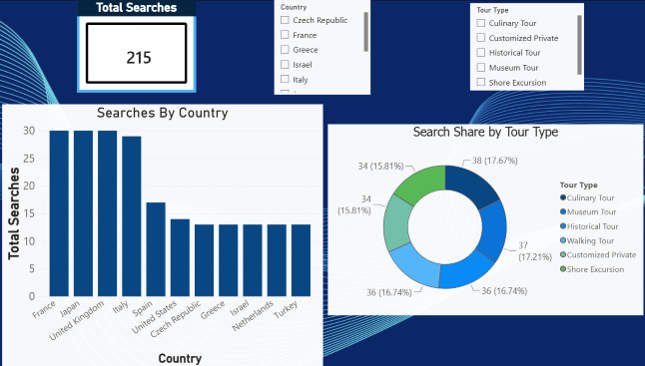

# ToursByLocals – SQL & Power BI Analytics

A database and data analytics project based on a tourism platform, designed to manage and analyze tours, bookings, guides, travellers, reviews and customer search activity.

The project combines relational database design, SQL analysis and Power BI visualization.

## Project Overview

The database models the core activity of a tourism platform connecting travellers with local guides.

The analysis focuses on:
- Tour and booking activity
- Guide performance and revenue
- Customer search behavior
- Popular destinations and tour categories
- Customer reviews and ratings

## Tools & Technologies

- SQL Server
- T-SQL
- Power BI
- Relational Database Design

## SQL Skills Demonstrated

The project includes:

- Multi-table JOINs
- GROUP BY and HAVING
- Subqueries
- Aggregate functions
- Window functions (`RANK`, `DENSE_RANK`, `LAG`, `LEAD`)
- Common Table Expressions (CTEs)
- Views
- User-defined functions
- Stored procedures
- Triggers
- TRY/CATCH error handling
- Primary and foreign keys
- Data integrity constraints

## Power BI Dashboard

The Power BI dashboard analyzes customer search activity across countries and tour types.

Key elements include:
- Total search KPI
- Searches by country
- Search share by tour type
- Interactive country and tour-type filters



## Repository Structure

```text
ToursByLocals-SQL-Analytics/
│
├── sql/
│   ├── database_creation.sql
│   ├── sample_data.sql
│   ├── analysis_queries.sql
│   └── advanced_sql.sql
│
├── search_analysis_dashboard.png
└── README.md
